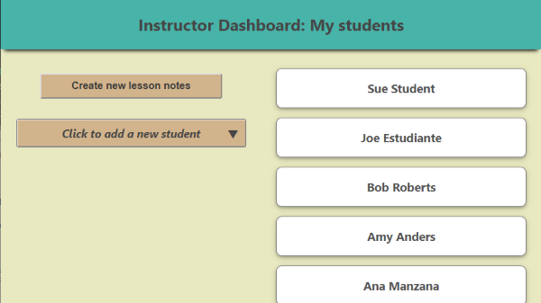
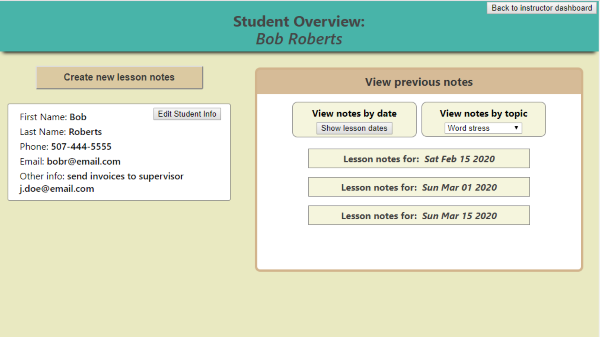

# Feedback Tracker Server
  This repo is the server for the Feedback Tracker App. The app is for instructors, tutors, coaches, trainers, or anyone who provides written feedback to students or trainees.

  The app lets you organize notes by category, and then later easily view notes based on a particular topic, issue, or benchmark.

  
  The app also works well for instructors who use a rubric for grading student projects.

## Screen shots of the app:

--------------------------------------------------

### This server is built with: 
- node.js
- sql
- knex

### Link to live app:
https://feedbacktracker.ljelias.now.sh

--------------------------------------------------
